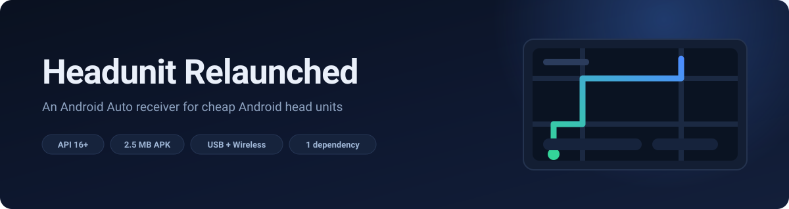
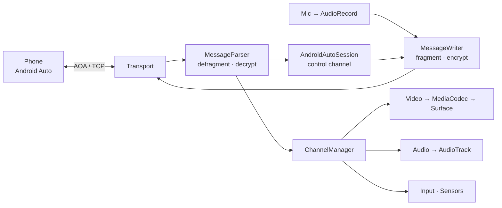

# Headunit Relaunched

An Android Auto **receiver** — turns a cheap Android head unit into the car screen.
Targets API 16 and 1GB single-DIN hardware. USB (AOA) and wireless (Bluetooth + TCP)
feed the same protocol session.

Built against [aasdk] / [OpenAuto] for the protocol and message ids; the wireless
Bluetooth handshake follows the AA-wireless dongle projects.

## Build

```bash
./gradlew :app:assembleDebug
```

~2.4 MB of the APK is Conscrypt's native libraries for three ABIs. Narrowing
`abiFilters` in [`app/build.gradle.kts`](app/build.gradle.kts) to `armeabi-v7a`
alone gets it to ~1.4 MB. No AndroidX (which would floor you at API 21), no
support library, no protobuf runtime, not even kotlin-stdlib.

```bash
./gradlew :app:testDebugUnitTest
```

Protocol tests run on the JVM — no device needed.

## Connecting

**USB** — plug the phone in. The service sees the attach broadcast, flips the phone
into AOA accessory mode and connects on its own.

**Wi-Fi, manual IP** — *the easiest path to a first picture.* Type the phone's IP in
and hit Connect. This dials `phoneIp:5277`, Android Auto's own head unit server, so
on the phone first do:

> Android Auto → About → tap the header 10× → ⋮ → **Start head unit server**

Same network is the only requirement: no Bluetooth, no hotspot credentials, no
pairing. It is the listener the Desktop Head Unit talks to over an ADB forward. The
IP is remembered and a dropped connection retries every 3s.

**Scan** finds it for you instead: a TCP connect to `:5277` across the local /24, 24
sockets in flight, first answer wins and connects. Whatever is in the IP box and the
DHCP gateway go first -- the gateway *is* the phone when the phone is the hotspot, so
the usual case answers before the sweep proper starts. Only silent addresses wait out
the 900ms timeout; a host that is up refuses a closed port at once. Two dozen threads
rather than 254 is the concession to 1GB hardware. No ICMP (needs root), no ARP table
(gone from API 29), no broadcast the phone would not answer.

It can only find a phone that is *already listening*, which means one with **Start head
unit server** switched on. Production wireless AA has nothing to find: there the phone
dials us, and only after the Bluetooth handshake. When a sweep comes back empty,
`adb logcat -s HU` prints the address it swept from and the tally:

```
scan: nothing found -- 256/256 probed, 3 answered, 253 silent, first miss ...
```

`0 answered` means nothing on that subnet was reached at all -- wrong interface, wrong
subnet, or AP client isolation. Anything above zero means the sweep is fine and the
phone simply is not listening on 5277.

**Wi-Fi, production wireless** — the Wi-Fi button. Roles reverse: we listen on 5288
and the phone dials *us*, but only after the Bluetooth RFCOMM handshake tells it
where to go. Needs `Config.WIFI_SSID` / `WIFI_PASSWORD` to match your hotspot, which
the app does **not** bring up for you. Least-verified path — see [Status](#status).

## Display

The **Resolution** button cycles Auto → 480p → 720p → 1080p; **Smaller** / **Bigger**
set the UI scale. Both persist.

Once video covers the screen the overlay is gone — **hold BACK** to bring it back
(a short BACK still reaches AA as its own back button). No BACK key on your unit?
Set these before connecting.

| Auto picks | from panel |
|---|---|
| 480p | ≤ 800x480 |
| 720p | up to 1280x720 |
| 1080p | larger |

**Any choice is capped to the panel, including a manual one.** Asking for more pixels
than the screen can show makes the display pipeline downscale every frame, which is
where video stalls on MediaTek's MDP have been traced to. When the cap bites, the
button says so: `Resolution: 1080p - capped to 1280 x 720 (panel 1196 x 720)`.
Panel measurement uses `getRealSize()` on API 17+, falling back to `getSize()` (which
under-reports by the nav bar) and then to 800x480 on a broken ROM.

Scale is stored as **layout width in dp**, not density, because dp means the same
thing at every resolution — 914dp looks identical whether the stream is 800 or 1920
pixels wide. Density is derived (`dpi = width_px * 160 / width_dp`), so changing
resolution keeps the scale you picked.

| layout | at 800x480 | |
|---|---|---|
| 1066 dp | 120 dpi | most content, smallest |
| 914 dp | 140 dpi | default |
| 800 dp | 160 dpi | |
| 640 dp | 200 dpi | least content, largest |

Bounded to 480–1280dp: below ~480dp AA runs out of room and starts mislaying things.
Neither setting has a protocol message to revise it — both travel only in the service
discovery response — so changing one while connected tears the session down and
rebuilds it. The phone treats that as an ordinary replug.

## Tuning for slow hardware

Everything lives in [`Config.java`](app/src/main/java/me/ri3d/headunit/relaunched/Config.java).
In order of impact:

| knob | default | note |
|---|---|---|
| `VIDEO_RESOLUTION` | `RES_AUTO` | see [Display](#display) |
| `VIDEO_FPS` | `FPS_30` | 60 roughly doubles decode cost |
| `VIDEO_DPI` | 140 | starting UI scale |
| `Logger.LEVEL` | — | **set to `Log.WARN` for real use** |

Logcat writes are synchronous; per-frame logging visibly costs frames.

## Debugging

```bash
adb logcat -s HU
```

Each state transition is logged (`handshake`, `TLS handshake`, `authenticated`,
`negotiating channels`) so you can see exactly where a connection dies, plus
`rx ch=N msg=0xNNNN` for every non-media message.

## Leaving Android Auto

AA's exit button arrives two different ways depending on version, so both are handled:

- **`ShutdownRequest`** (control, reason 1 = QUIT) — a real quit. We answer, end the
  session with reason `closed by Android Auto`, and deliberately **do not** reconnect.
  Auto-retry is right for a yanked cable and wrong here; without the distinct reason
  it put AA back on screen three seconds later.
- **`VideoFocusRequest{NATIVE}`** (video channel) — hands the screen back without
  quitting. Session stays up, phone stops drawing, overlay returns. The phone will not
  resume on its own: hold BACK to send `VideoFocusIndication{PROJECTED}`.

Both routes obey the panel's **Android Auto exit** toggle: *back to this panel*
(default) or *close the app*, which also stops the service — left running it would
reconnect on the next USB attach with no activity and no surface to draw on. The
choice persists.

A drop nobody asked for — cable flake, phone reboot, Wi-Fi gone — instead brings up a
**Reconnecting** screen (spinner, live state line) while the session is retried every
3s, and the picture comes straight back when it lands. Unplugging USB shows it too:
the attach broadcast reconnects on replug without anyone tapping anything. Tapping
the screen uncovers the control panel and leaves the retry running; **Stop searching**
ends it, for the unplug you did mean. A stop that *was*
asked for — the Disconnect button, or AA's own quit — skips all of it and lands on
the panel.

## Camera interruptions

Reverse and turn-signal cameras take the screen from us and hand it back, which
destroys and recreates the SurfaceView. Both halves need handling: on API < 23 there
is no `setOutputSurface`, so the new Surface means a new codec, and a new codec has
no reference frames. Android Auto sends a keyframe when it is *told* it has the
screen, not on a timer, so a decoder restarted in the middle of a GOP is fed
P-frames against nothing and the panel stays black for good.

So the screen going away sends `VideoFocusIndication{NATIVE}` and getting it back
sends `PROJECTED` -- both halves, because only a *transition* makes AA restart its
encoder. Repeating PROJECTED at a phone that already thinks it is projecting changes
nothing over there, which is the difference between the picture returning at once and
returning whenever AA next felt like a keyframe.

Coming back arrives by two routes, since a camera app may or may not destroy the
Surface on its way past: the SurfaceView callback when it did, `onResume` when it did
not. The codec is only rebuilt when it actually died -- a needless restart costs its
own black flicker.

The keyframe is then protected on arrival: until a stream has produced its first
frame, `dequeueInputBuffer` waits 250ms instead of 20ms rather than dropping what it
is handed. A freshly started codec is exactly when input buffers are scarce, and the
access unit in flight then is the one every later frame references. In logcat the
recovery reads:

```
video: decoder started 800x480
video: claiming video focus (projected)
video: first frame rendered
```

No third line means the phone is not sending; no first line means the Surface never
came back.

## How it works



```
MainActivity          SurfaceView + overlay, plain android.app.Activity
HeadUnitService       owns the connection across activity restarts
Config                every tunable, one file

transport/  Transport         connect/read/write/close -- all protocol/ knows
            UsbTransport      USB host, phone as AOA accessory
            WifiTransport     dial phone:5277, or listen on 5288
usb/        UsbAoa            the control transfers that flip a phone into accessory mode
wifi/       WirelessDiscovery Bluetooth RFCOMM handshake, listen mode only

protocol/   AndroidAutoSession  reader thread + control channel state machine
            HandshakeManager    version exchange, TLS, auth complete
            MessageParser       frames in: defragment, decrypt, dispatch
            MessageWriter       messages out: fragment, encrypt, one write per frame
            ChannelManager      routes non-control channels
            Ssl                 SSLEngine driven by hand (records ride inside AA messages)
            Proto / Messages    ~250 line protobuf codec + the AA messages we use

video/      MediaCodec -> Surface, no Bitmap anywhere
audio/      AudioChannel, AudioOutput, MicChannel
input/      InputChannel, TouchInput, KeyInput
sensor/     driving status + night mode
```

Four threads, and no more. Nothing polls — every wait is a blocking call with a
timeout, not a spin.

| thread | what it does | why it exists |
|---|---|---|
| `hu-session` | reads frames, decrypts, dispatches, replies | the whole protocol |
| `hu-video` | drains MediaCodec output to the Surface | `dequeueOutputBuffer` blocks |
| `hu-audio-*` | writes PCM to an AudioTrack | `AudioTrack.write` blocks |
| `hu-mic` | reads the mic, sends PCM | only while the phone has the mic open |

After connect, the steady state allocates nothing per frame: one 48KB receive ring
with frames sliced out in place, a reusable `Proto.W` under a lock with the message id
back-filled (no gather step), `ByteBuffer` wrappers cached per backing array in `Ssl`,
and a fixed ring of PCM slots recycled forever.

## Status

Confirmed against a real phone running Android Auto **1.7** over the manual-IP
transport: TLS handshake, service discovery, all seven channels, input binding,
sensors, H.264 at ~28-30fps, audio setup/start.

**Least verified:** the wireless Bluetooth handshake
(`wifi/WirelessDiscovery.java`) — the Wi-Fi *listen* path only. Its RFCOMM message ids
and field numbers come from the AA-wireless dongle projects. The manual-IP path avoids
all of it, so use that first when bringing a new unit up.

---

<details>
<summary><b>The FRAME_CONTROL bit</b> — getting it wrong produces no error at all</summary>

`FRAME_CONTROL` (0x04) marks a message whose id belongs to the *control-channel* range
(1..26) but which is delivered on a **media** channel. In practice that is exactly one
message: `CHANNEL_OPEN_RESPONSE`, which goes out on the channel being opened rather
than on channel 0.

```
CHANNEL_OPEN_RESPONSE on channel 3   -> flags 0x0f   (FIRST|LAST|CONTROL|ENCRYPTED)
SENSOR_EVENT (0x8003) on channel 2   -> flags 0x0b   (no CONTROL)
VIDEO_FOCUS  (0x8008) on channel 3   -> flags 0x0b
anything at all on channel 0         -> flags 0x0b
```

Send the open response without the bit and the phone requests every channel, silently
discards each response, and the session sits idle forever after service discovery —
no error, no disconnect, no log line. `needsControlFlag()` in `ProtocolConstants` is
the rule.

</details>

<details>
<summary><b>TLS identity</b> — the certificate and how it loads</summary>

`app/src/main/res/raw/cert` and `res/raw/privkey` are Google's published head-unit
reference identity, the certificate Android Auto requires a head unit to present:

```
subject: O=Google-Android-Reference, L=Mountain View, ST=CA, C=US
issuer : O=Google Automotive Link, L=Mountain View, ST=California, C=US
RSA 2048, valid until 2044-07-08
```

No build step: plain PEM, read straight out of `res/raw`.

Two details in [`Ssl.java`](app/src/main/java/me/ri3d/headunit/relaunched/protocol/Ssl.java)
are easy to get wrong:

- the key is **PKCS#8** (`BEGIN PRIVATE KEY`), so it loads via `PKCS8EncodedKeySpec` +
  `KeyFactory("RSA")` — no keystore file, no `openssl`
- the `KeyManager` returns its alias **unconditionally**. A stock KeyManager only
  offers a client certificate when the server's `CertificateRequest` names an issuer it
  recognises; AA's request does not line up, so the default returns no alias, no
  certificate is sent, and the phone drops the connection mid-handshake with nothing
  useful in the log.

</details>

<details>
<summary><b>Why Conscrypt is not optional</b> — and three rules that crash natively</summary>

API 16's built-in JSSE has TLS 1.2, but its cipher suites stop at
`ECDHE_RSA_WITH_AES_128_CBC_SHA` — AES-GCM only arrived around API 20. Current Android
Auto will not negotiate anything older, so the handshake is refused and the phone shows:

> **Communication error 7** — Android Auto can't connect to your car due to a security
> problem with the car display.

That message means TLS, not wiring. [Conscrypt] is BoringSSL packaged as a JSSE
provider. `2.5.3` is the last release supporting minSdk 16 (its manifest declares 9);
2.6.x needs a higher floor, so **do not bump it** without testing on a 4.x device.

Three rules in `Ssl`, all learned the hard way. Break any and you get a native crash,
not an exception:

- **The private key must come from Conscrypt's own `KeyFactory`.**
  `KeyFactory.getInstance("RSA")` on API 16 returns a key backed by the *platform's*
  OpenSSL. Conscrypt bundles a separate BoringSSL, so signing the client
  CertificateVerify with that key dereferences a foreign pointer:

  ```
  signal 11 (SIGSEGV), fault addr 00000001
    #00  RSA_sign_pss_mgf1+38
    #02  EVP_PKEY_sign
    #03  EVP_DigestSignFinal
    #08  SSL_do_handshake
  ```

  Passing the provider explicitly fixes it — check the log says
  `private key org.conscrypt.OpenSSLRSAPrivateKey`, not a platform class. (Projects that
  call `Security.insertProviderAt` get this free, by making Conscrypt the default for
  everything.)
- **Never call `unwrap()` with nothing buffered.** After wrapping the ClientHello the
  status goes straight to `NEED_UNWRAP`, but the peer has obviously not replied yet.
  The platform provider returned `BUFFER_UNDERFLOW`; Conscrypt does not.
- **Destination buffers are `allocateDirect`, and handshake wraps pass an empty
  `ByteBuffer[]`, not `ByteBuffer.allocate(0)`.** Heap destinations take a much less
  exercised JNI path.

`Ssl` logs this on every connection — if the GCM count is 0, Conscrypt did not load and
the handshake will fail:

```
SSL: engine=org.conscrypt.Java8EngineWrapper protocols=TLSv1.2,... suites=N (M GCM)
```

</details>

<details>
<summary><b>Emulator caveats</b> — an API 16 x86 AVD will mislead you</summary>

- `screencap` cannot read back the SurfaceView layer, so screenshots are black even
  while video plays. Check `dumpsys SurfaceFlinger` for
  `Layer (SurfaceView) activeBuffer=[800x480]` instead.
- Hardware GPU emulation often drops the SurfaceView entirely. Switch the AVD to
  *Software - GLES 2.0* if you see nothing.
- Audio output is a stub (`AudioStreamOutGeneric`), so AudioFlinger never drains the
  track and you get endless `obtainBuffer timed out (is the CPU pegged?)`. That warning
  is meaningless on the emulator.

</details>

[aasdk]: https://github.com/f1xpl/aasdk
[OpenAuto]: https://github.com/f1xpl/openauto
[Conscrypt]: https://github.com/google/conscrypt
